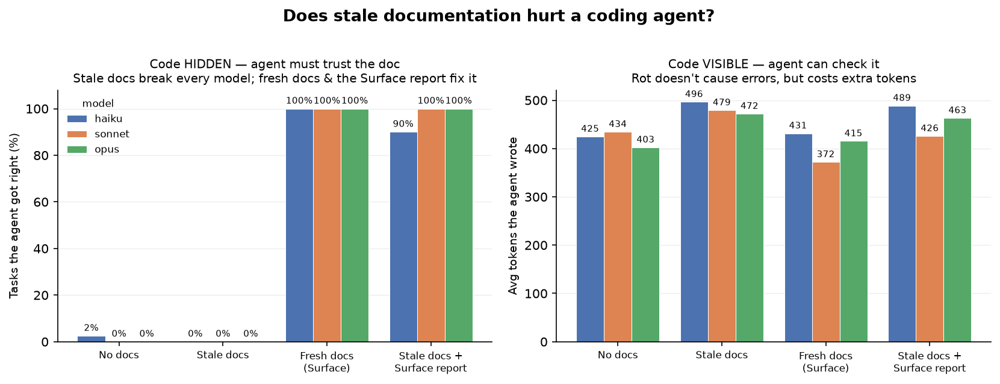

# Plain-language summary

A non-technical companion to `report.md` — the same findings without the statistics vocabulary.
("Model" means the coding assistant doing the work, Claude in this study; sometimes called an
"agent.")

## What we tested

Coding assistants rely on a project's documentation to understand code they can't read in full. But
documentation goes stale: someone changes the code and the docs describing it don't get updated. We
measured a straightforward question — when the docs are out of date, does it actually degrade the
model's work? And does it help to automatically flag the parts that have drifted? That flag is what
Surface, the tool this benchmark tests, produces.

## How the test worked

We gave a model the same task four ways, changing only the documentation it received:

- **No docs** — just the code.
- **Stale docs** — documentation that was correct once but no longer matches the code.
- **Fresh docs** — documentation that matches the code.
- **Stale docs + a Surface drift report** — the stale docs, plus an automated note saying "this no
  longer matches the code, and here is what changed."

We ran every task two ways:

- **Code visible** — the exact code the task depends on is in front of the model.
- **Code hidden** — that code is not provided, so the model has only the documentation to go on.
  This is the realistic case: in a large codebase nobody, and no model, sees everything, so the
  documentation is the map.

Each task was repeated ten times across three Claude models, from the smallest to the most capable.

## What we found

**When the relevant code was hidden:**

- Stale docs made the model wrong every time — never correct, and it confidently repeated the
  outdated "fact" in every run.
- A more capable model was no more resistant. The most powerful model failed exactly as often as the
  smallest. Paying for a better model does not protect you from stale docs.
- Fresh docs produced a correct answer every time.
- The Surface drift report recovered the result — fully correct again on the two larger models, and
  nearly so on the smallest. Flagging the drift was enough to undo the damage.

**When the relevant code was visible:**

- Stale docs did not cause wrong answers — the model simply read the code and ignored the bad notes.
- But they cost more. The model spent measurably more effort reconciling the stale docs against the
  code. (That effort is counted in "tokens" — roughly how much the model reads and writes, which
  translates directly into time and money.)

In short: **stale documentation the model can't verify makes it wrong; stale documentation it can
verify makes it slower and more expensive.** A more capable model fixes neither — surfacing the
drift does.

The full run cost about **$14** and completed with no errors.

## What it's worth

There are two kinds of savings here, and they are very different in size.

The smaller one is model cost. Where the assistant can see the code, out-of-date docs make it do
extra work, which you pay for in usage. Keeping docs accurate trims that — but only by roughly
**$0.30 to $1.60 per thousand tasks**, depending on the model. Real, but minor. (And it's a floor:
an assistant that works in a back-and-forth loop would waste more.)

The bigger one — by far — is avoided rework. When the assistant *can't* see the code and the docs
are wrong, it doesn't waste effort, it just produces the wrong result. In our tests that happened on
**every such task without Surface, and essentially none with it.** Putting a number on that depends
on your situation, but the shape is simple:

> roughly: (how many tasks your assistants run) × (how often they rely on docs they can't verify) ×
> (what it costs to catch and fix one wrong change)

For example: 10,000 assistant tasks a month, 1 in 50 touching code whose docs have drifted, and $50
to catch and fix each wrong change, works out to about **$10,000 a month** — against a few dollars of
usage savings. The point for a decision-maker: the value of Surface is mostly in **preventing wrong
work**, not in trimming usage bills, and it grows with how much your assistants rely on
documentation they can't double-check.

(The failure rates and usage figures are measured; the task volume, how-often, and fix-cost are
yours to fill in — the example numbers are just an illustration.)

## What we learned

- **Framing changes the result.** Our first attempt found nothing, because we had told the model to
  trust the code over the docs — which hides the very problem we were trying to measure. Removing
  that instruction revealed the effect.
- **The damage concentrates where the model can't check.** Stale docs matter most for the parts of a
  system the model can't see, which in practice is most of it.
- **The test caught our own mistakes.** An early version accidentally leaked a hint in the task
  wording; the results flagged it and we removed it.
- **We hit and fixed a reliability bug.** One request to the model stalled the whole run; we added a
  timeout, preserved the completed data, and re-ran only the unfinished part.

## What's next

- Test an assistant that works in a loop — read, edit, run tests, fix — rather than answering in one
  shot, which is likely where wasted effort is largest.
- Test models from other providers, to see whether "a better model doesn't help" holds beyond Claude.
- Reproduce the effect on a real, public codebase rather than purpose-built examples.

---

*For the full numbers, ranges, exact prompts, and methodology, see `report.md`.*
